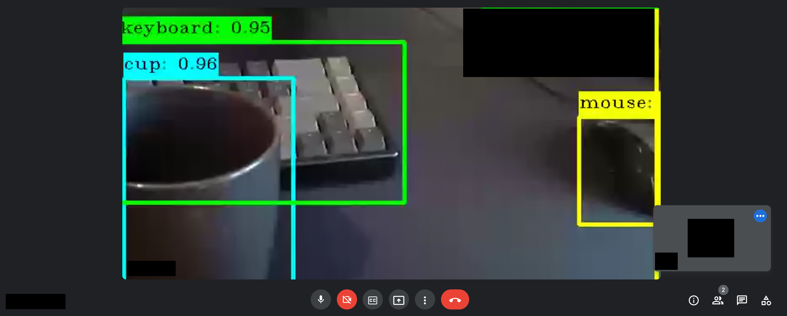

# Object detection overlay for video feeds



Just a small proof of concept for real-time object detection in video/webcam feeds. 
When running, frames captured by webcam are propagated through a classifier, annotated with labels, bounding boxes and then written to a virtual webcam.
The virtual webcam containing the annotated video stream can then be used as a regular webcam (e.g. in video calls).

Object detection is based on [YOLOv3](https://pjreddie.com/darknet/yolo/)

## Prerequisites

* [Opencv (preferably with GPU support)](https://github.com/opencv/opencv)
* [V4l2loopback](https://github.com/umlaeute/v4l2loopback)

## Known issues

* Without gpu support fps will be very low
* Some apps may not recognize virtual webcam correctly (notably firefox)
* Due to V4l2 dependency only working on linux currently

## Build and run

*Note: If the virtual cam has not yet already been created you will need sudo rights to install the v4l2loopback kernel module*
```
$ git clone https://github.com/bw0248/video-feed-object-detection.git
$ cd video-feed-object-detection/

$ ./run [--dev WEBCAM_DEVICE] [--virtual-dev VIRTUAL_CAM_DEVICE] [--tiny] [--gui] [--fps]

   --dev            which webcam to use (defaults to /dev/video0)
   --virtual-dev    virtual webcam to use/create (defaults to /dev/video99)
   --tiny           use tiny model (more fps, less accuracy)
   --gui            show simple opencv gui of actual webcam feed (w/o annotations) 
   --fps            show fps in overlay
```

## Usage

Examples (replace `$VIRTUAL_DEV` with the configured virtual device, default is `/dev/video99`)

* `ffplay $VIRTUAL_DEV`
* `cheese -d vfod-cam`
* `mpv av://video4linux2:$VIRTUAL_DEV --profile=low-latency`
* select the virtual cam in video calls

## Remove virtual cam

To uninstall the v4l2loopback module run: `$ sudo modprobe -r v4l2loopback`

## Possible next steps

* [ ] troubleshoot virtual cam not working in firefox - might need to transform color space of frames
* [ ] optimize fps
* [ ] find equivalents of linux dependencies for macos, windows

